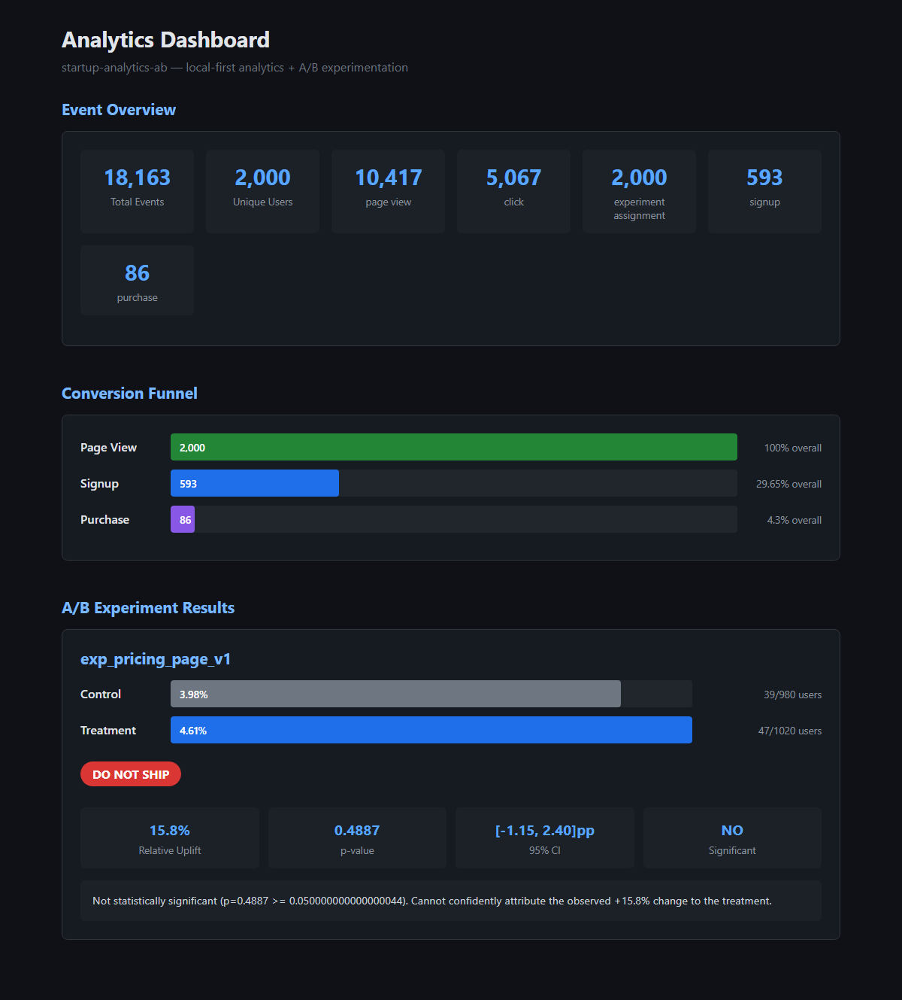

# startup-analytics-ab

A zero-cost, local-first analytics and A/B experimentation platform built for startups.

## Overview

This system demonstrates a production-grade approach to:
- Event tracking and ingestion via a REST API
- Data warehousing with DuckDB (append-only, idempotent)
- SQL transformations via dbt (staging + mart models)
- Deterministic A/B experiment assignment (hash-based, not random)
- Statistical experiment analysis (z-test, confidence intervals, p-values)
- Automated ship/no-ship decisions backed by data
- CI pipeline that validates analytics integrity end-to-end

**No paid services. No cloud required. Local + open source only.**

## Dashboard



## Architecture

```
 Events flow left-to-right through the pipeline:

 ┌──────────────┐     ┌──────────────┐     ┌──────────────┐
 │   Simulator  │────▶│   Collector   │────▶│   DuckDB     │
 │   (or real   │     │   (FastAPI)   │     │   Warehouse  │
 │    traffic)  │     │   /ingest     │     │  raw_events  │
 └──────────────┘     └──────────────┘     └──────┬───────┘
                                                   │
                            ┌──────────────────────┘
                            ▼
                      ┌──────────────┐     ┌──────────────┐
                      │   dbt        │────▶│   Export      │
                      │   Models     │     │   (JSON)      │
                      │  staging →   │     └──────┬───────┘
                      │  marts       │            │
                      └──────────────┘            ▼
                                           ┌──────────────┐
                      ┌──────────────┐     │   Dashboard   │
                      │  Experiment  │────▶│   (HTML/JS)   │
                      │  Analysis    │     │              │
                      │  (scipy)     │     └──────────────┘
                      └──────────────┘
```

### Data flow

1. **Collect**: Events arrive via `POST /ingest` (or are generated by the simulator)
2. **Store**: Raw events land in DuckDB with idempotency via primary key deduplication
3. **Transform**: dbt models stage raw events, then build funnel and experiment mart tables
4. **Analyze**: The analysis module queries experiment data, runs a two-proportion z-test, and produces a ship/no-ship decision
5. **Export**: Results are serialized to JSON for the static dashboard
6. **Visualize**: The HTML dashboard renders funnel charts and experiment results

## Stack

| Component       | Technology         | Why                                                  |
|-----------------|--------------------|------------------------------------------------------|
| Event API       | Python / FastAPI   | Async, schema validation via Pydantic, lightweight   |
| Warehouse       | DuckDB             | Embedded OLAP, zero-config, SQL-native               |
| Transformations | dbt (dbt-duckdb)   | Industry-standard SQL modeling, testable              |
| Simulator       | Python (seeded)    | Reproducible user behavior generation                |
| A/B Assignment  | SHA-256 hashing    | Deterministic, no randomness, consistent bucketing   |
| Analysis        | scipy              | Two-proportion z-test with confidence intervals      |
| Dashboard       | HTML + vanilla JS  | Zero dependencies, static, works offline             |
| CI              | GitHub Actions     | Lint + test + full pipeline integrity validation     |

## Quick Start

```bash
# 1. Clone and install
git clone https://github.com/Suraj370/startup-analytics-ab-platform.git
cd startup-analytics-ab-platform
make install

# 2. Generate 2,000 simulated users with A/B experiment
make simulate

# 3. Run experiment analysis (prints report to terminal)
make analyze

# 4. Export data and launch dashboard at http://localhost:8080
make dashboard
```

Or run everything in one command:

```bash
make demo   # simulate -> export -> analyze
```

### Full command reference

| Command              | What it does                                        |
|----------------------|-----------------------------------------------------|
| `make install`       | Install Python dependencies                         |
| `make simulate`      | Generate events for 2,000 users with A/B experiment |
| `make run-collector` | Start FastAPI event collector on port 8000           |
| `make transform`     | Run dbt models (staging + marts)                    |
| `make analyze`       | Print experiment analysis report                    |
| `make export`        | Export warehouse data to JSON                       |
| `make dashboard`     | Export + serve dashboard on port 8080               |
| `make demo`          | Full pipeline: simulate + export + analyze          |
| `make test`          | Run all 116 tests                                   |
| `make lint`          | Lint with ruff                                      |
| `make clean`         | Remove generated data and caches                    |

## Project Structure

```
startup-analytics-ab/
├── src/
│   ├── collector/        # FastAPI event ingestion (schemas, app)
│   ├── warehouse/        # DuckDB storage layer (init, insert, query)
│   ├── simulator/        # Seeded user behavior generator
│   │   ├── config.py     # Funnel probabilities and simulation params
│   │   └── engine.py     # Event generation with realistic dropoff
│   ├── ab/               # A/B experimentation
│   │   ├── experiment.py # Experiment + variant definitions
│   │   └── assignment.py # Deterministic hash-based assignment
│   ├── analysis/         # Statistical analysis + export
│   │   ├── stats.py      # z-test, CI, decision framework
│   │   ├── run.py        # CLI for experiment analysis
│   │   └── export.py     # Warehouse -> JSON for dashboard
│   └── dashboard/        # Static HTML + JS visualization
├── dbt/
│   ├── models/
│   │   ├── staging/      # stg_events (clean + extract JSON fields)
│   │   └── marts/        # fct_user_journey, fct_funnel, fct_experiment_results
│   └── tests/            # Data quality tests (funnel monotonicity)
├── tests/                # 116 unit and integration tests
├── ci/                   # CI validation script
├── .github/workflows/    # GitHub Actions CI pipeline
├── docs/                 # Dashboard screenshot
├── Makefile
└── requirements.txt
```

## How the A/B Experiment Works

### Assignment

Users are assigned to variants **deterministically** using SHA-256 hashing:

```
hash = SHA-256("experiment_id:user_id")
bucket = first_8_bytes_as_uint64 / max_uint64   # -> [0, 1)
variant = map bucket to cumulative variant weights
```

This means:
- The same user always gets the same variant (no database lookup needed)
- Different experiments produce different assignments for the same user
- Assignment is instant and stateless
- A 50/50 split produces a near-perfect even distribution

### Analysis

The experiment analysis uses a **two-proportion z-test**:

1. **Null hypothesis**: Treatment conversion rate = Control conversion rate
2. **Test statistic**: z = (p_treatment - p_control) / SE_pooled
3. **p-value**: Two-tailed from the standard normal distribution
4. **Confidence interval**: Built with unpooled standard error for accuracy

### Decision Framework

| Condition | Decision |
|-----------|----------|
| p < 0.05 AND uplift > 0 AND CI entirely above 0 | **SHIP** |
| p < 0.05 AND uplift < 0 | **DO NOT SHIP** (harmful) |
| p >= 0.05 | **DO NOT SHIP** (not significant) |
| Sample size < 100 per variant | **INCONCLUSIVE** |

### Example Output

```
============================================================
EXPERIMENT ANALYSIS: exp_pricing_page_v1
============================================================

VARIANT SUMMARY
  Control:   39/980 = 3.98% conversion rate
  Treatment: 47/1020 = 4.61% conversion rate

STATISTICAL RESULTS
  Absolute uplift:  +0.0063 (+15.8% relative)
  p-value:          0.4887
  95% CI:           [-0.0115, +0.0240]
  Significant:      NO

DECISION: DO NOT SHIP
  Not statistically significant (p=0.4887 >= 0.05).
============================================================
```

## Design Principles

- **Append-only events**: Raw events are immutable once ingested
- **Idempotent ingestion**: Duplicate events are silently rejected via primary key
- **Reproducible simulation**: Seeded RNG + hash-based IDs produce identical output given the same seed
- **Deterministic assignment**: A/B bucketing uses SHA-256, not randomness
- **Explainable metrics**: Every dashboard number traces back to raw events through SQL
- **Detectable failures**: CI runs the full pipeline and validates structural invariants

## CI Pipeline

The GitHub Actions workflow (`.github/workflows/ci.yml`) runs two jobs:

1. **test**: Lint (ruff) + run all 116 unit tests
2. **analytics-integrity**: Simulate events -> export dashboard data -> validate invariants

The validation script (`ci/validate_analytics.py`) checks:
- All required event types are present
- Funnel is monotonically decreasing (page_view >= signup >= purchase)
- Experiments have both control and treatment variants
- Analysis results include all required fields
- p-values are in the valid [0, 1] range
- Decisions are one of SHIP / DO NOT SHIP / INCONCLUSIVE

## Tradeoffs

| Decision | Why | Alternative |
|----------|-----|-------------|
| DuckDB over Postgres | Zero-config, embedded, fast OLAP, no server | Postgres for multi-user production |
| Static HTML over React | No build step, works offline, zero JS deps | React/Next.js for interactive dashboards |
| Two-proportion z-test over Bayesian | Simple, well-understood, standard in industry | Bayesian for continuous monitoring / early stopping |
| SHA-256 assignment over random | Deterministic, stateless, no storage needed | Database-backed for complex targeting rules |
| Simulated data over real | Reproducible, no PII, instant setup | Real event streams for production validation |
| dbt models over raw SQL | Testable, documented, industry-standard | Raw SQL for simpler setups |
| Flat JSON export over API | No server needed for dashboard, works as static site | REST API for real-time dashboards |

## Next Steps

If extending this into a production system:

- **Real-time ingestion**: Replace batch export with a streaming pipeline (Kafka / Redis Streams)
- **Multi-experiment support**: Run multiple concurrent experiments with mutual exclusion
- **Bayesian analysis**: Add Thompson sampling or Bayesian credible intervals for continuous monitoring
- **Segmentation**: Slice experiment results by user cohorts (geography, device, plan)
- **Feature flags**: Integrate assignment with a feature flag system (e.g., LaunchDarkly-style)
- **Persistent dashboard**: Replace static JSON with a live API + WebSocket updates
- **Data retention**: Add TTL policies and archival for raw events
- **Auth + RBAC**: Protect the collector API and dashboard access
- **Alerting**: Trigger alerts when experiment metrics degrade or sample ratio mismatch is detected

## License

MIT
